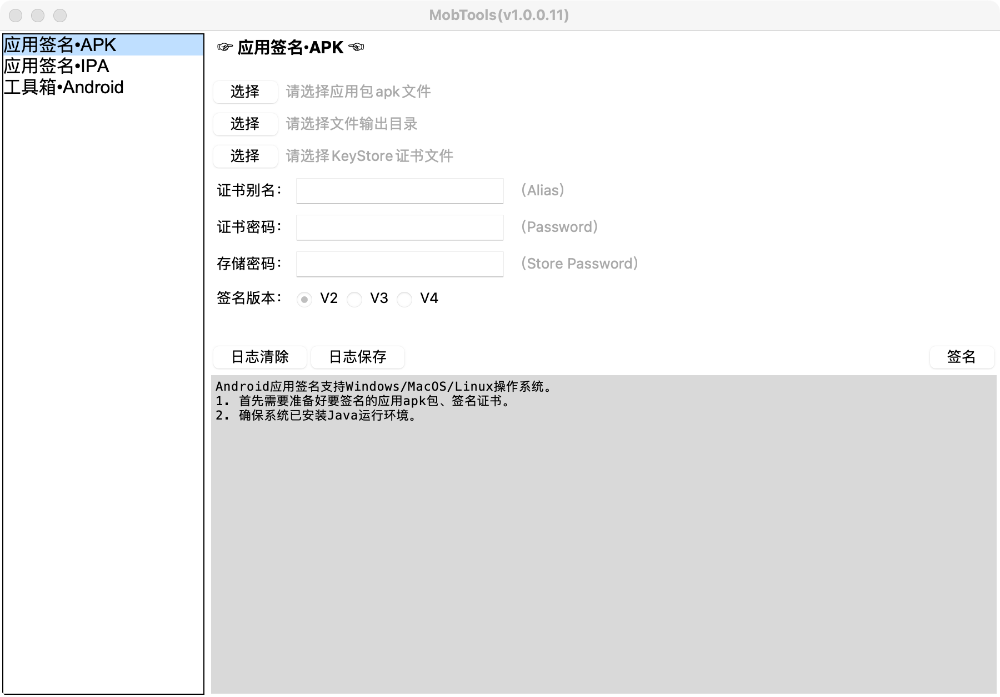
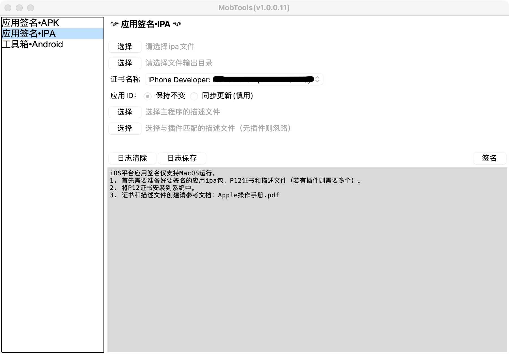
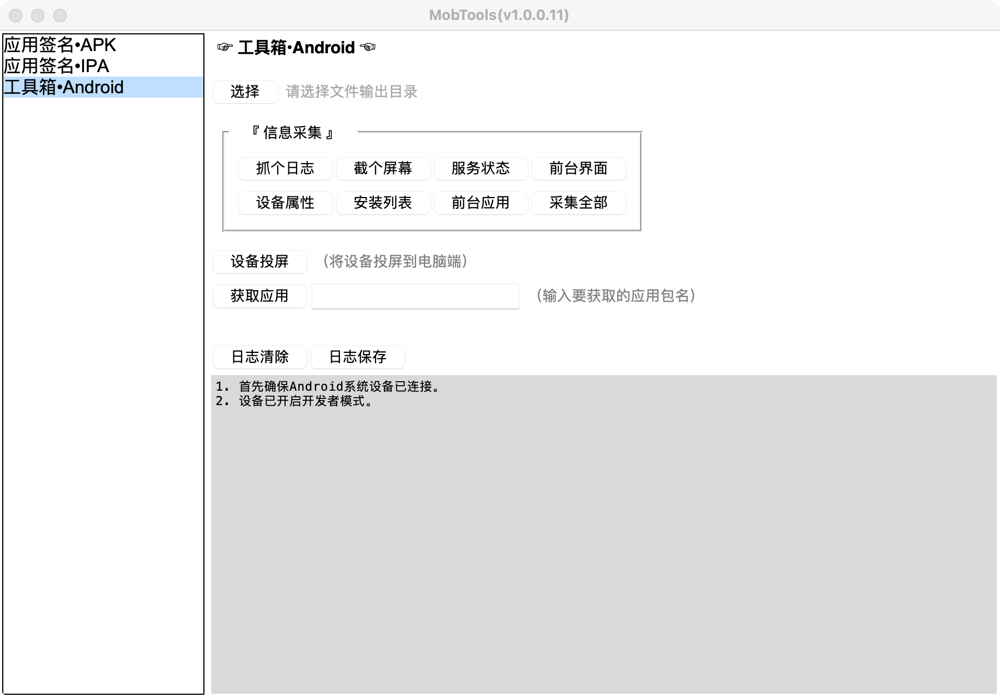
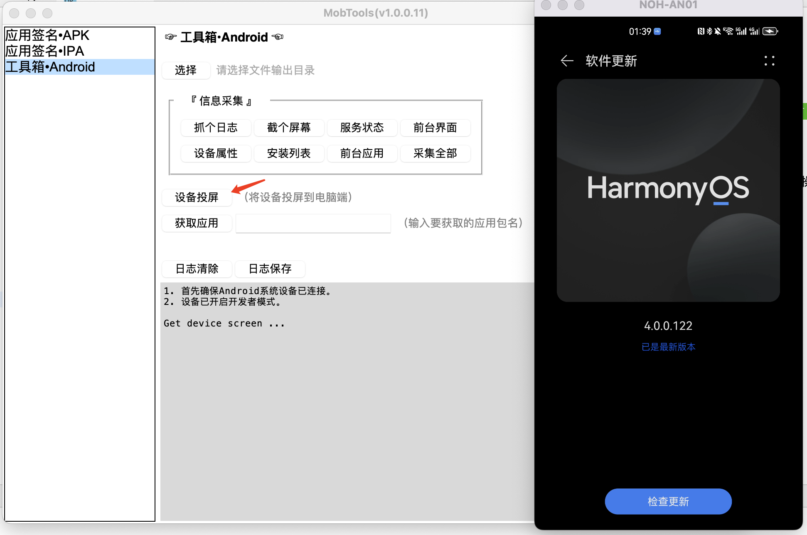

# MobTools

    
    

## 说明

该项目基于[【Tinyui】](https://github.com/iofomo/tinyui)框架开发。为电脑端操作移动设备提供便捷操作的工具。

## 导航

-   [操作指南](https://www.iofomo.com/docs/desktop/mobtools/Guider)

## 功能

### Android应用签名

### iOS应用重签名

### Android平台工具箱

## 许可协议

本项目基于`MIT`许可协议，详情查看 [许可协议](doc/LICENSE) 文档。

>   本项目和所有的工具都是MIT许可证下的开源工具，这意味着你可以完全访问源代码，并可以根据自己的需求进行修改。

